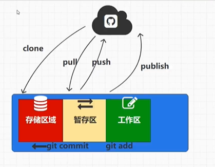

#### git基于本地仓库操作，也就是上图的存储区域

clone从远程仓库下载

publish发布自己的项目到远程仓库

git add 从工作区将文件add到比对区进行比对

git commit从比对区推送到本地仓库

当远程仓库有变化时，用pull拉取到本地仓库

当本地仓库有变化时，用push推到远程仓库

#### git --version 查看版本

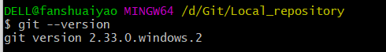

#### 首先用git init 将文件初始化成一个git文件

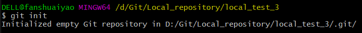

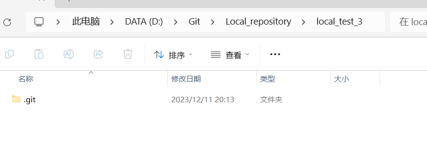

#### 从远程仓库拉取仓库 git clone https://...

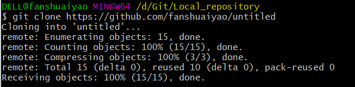

#### 从远程拉取的时候想换个名字 git clone https://... new name

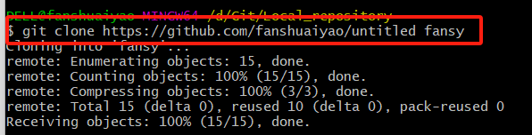

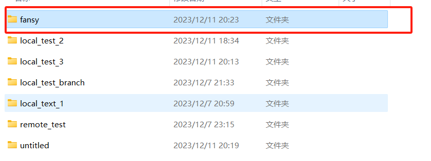

#### 配置全局用户名称和全局用户邮箱

git config --global user.name fanshuaiyao

git config --global user.email 1345822123@qq.com

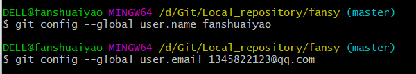

配置完成之后在此地查看

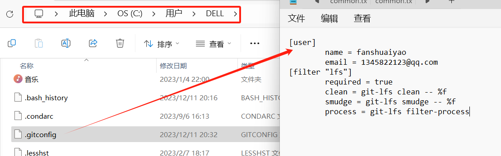

#### git status查看暂存区的状态

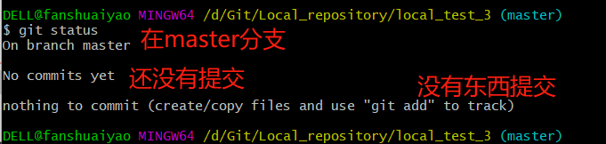

#### 新建一个文件a.txt，在进行状态查看，会显示未行踪

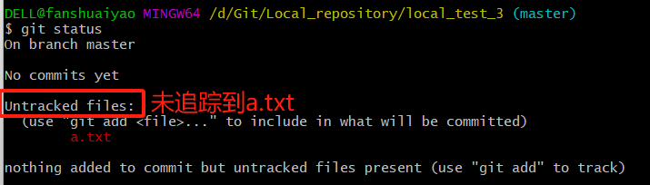

#### 使用git add a.txt将文件从工作区放到暂存区，再进行状态查看(git status)

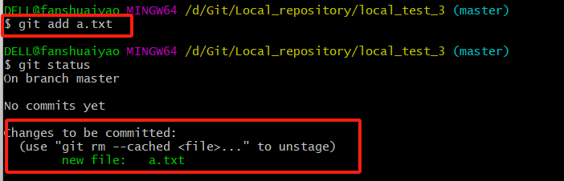

#### 从暂存区放回工作区用git rm --cached a.txt，再查看状态（git status）就会又显示这个文件未追踪到

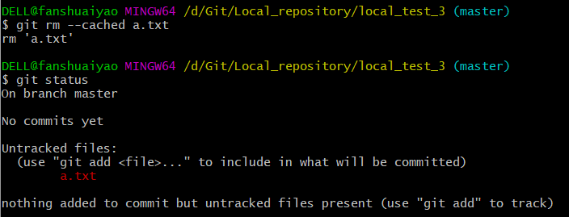

#### 也可以使用通配符来进行批量次提交 git add *.txt

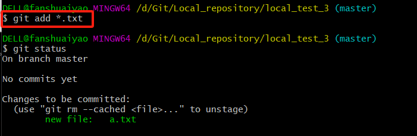

#### 用git commit来进行文件的提交，也就是从暂存区提交到本地仓库存储区，-m后面跟备注

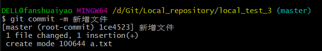

#### 再来查看状态，工作区很干净

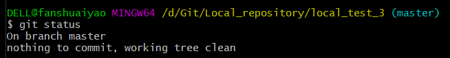

#### 可以用git add . 来添加所有文件

#### 用git log查看历史记录

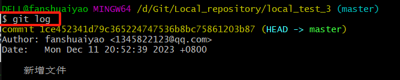

#### 可以简化查看历史记录 git log --oneline 使得版本号只显示前7个

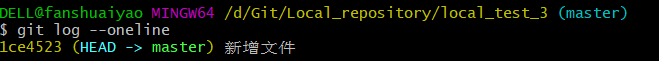

#### 修改文件，status改变

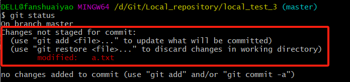

#### 修改之后，在软件操作可以直接commit，命令行不行，先add再commit

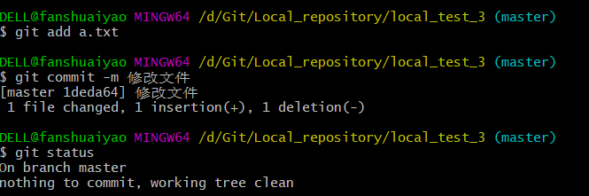

#### 查看修改的历史记录

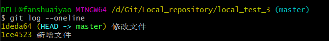

#### 删除文件，查看了一下暂存区的状态为

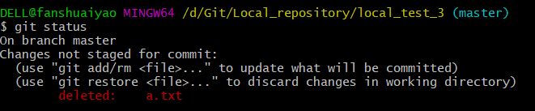

#### 删除也是提交，add加commit就ok

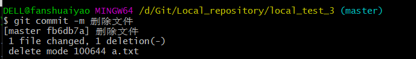

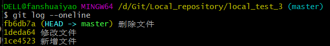

#### 如果误删除了工作区的文件，在已经提交，且删除操作没有提交的状态下，我们可以从存储区拉回来，使用git restore a.txt恢复文件

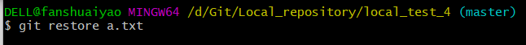

#### 如果提交删除也提交了，我们也可以将版本重置，使用git reset --hard （版本号）但此时历史记录丢失了删除的提交记录

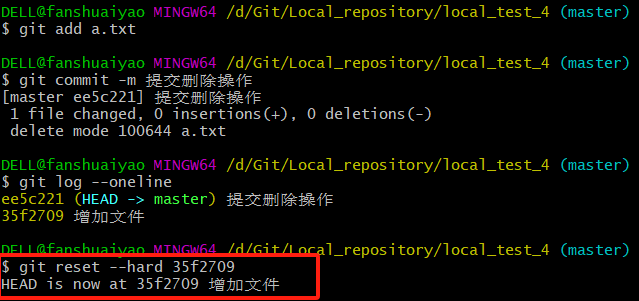

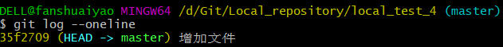

#### 也可以不丢失，使用git revert 版本号（这个版本号是最新的）

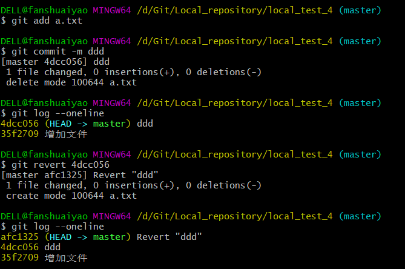

#### 创建分支，在空仓库时没有提交的情况下，不能创建分支，当有了提交之后才能有创建分支的操作，创建分支使用git branch 分支名

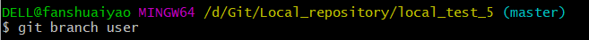

#### 查看当前有多少个分支 git branch -v

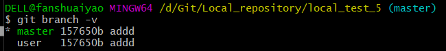

#### 更改分支名称 git branch -m oldName newName

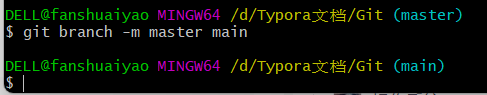

#### 切换分支使用git checkout user

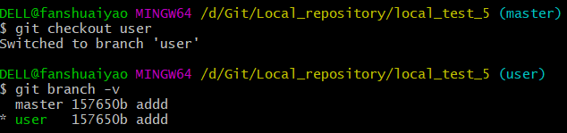

#### 将创建分支和切换分支合并成一步，使用 git checkout -b 分支名

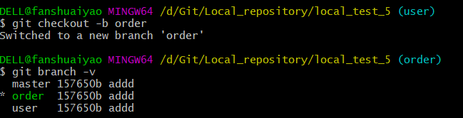

#### 对分支进行删除 git branch -d 分支名

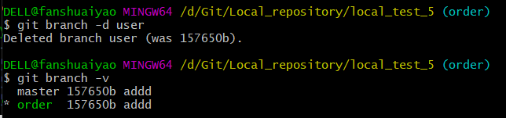

#### 对分支进行合并，先切换到master分支上，两个分支都有同名文件，需要人工干预

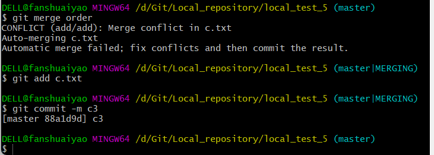

#### 标签的创建与删除

#### git tag查看所有标签

#### 【git tag 标签名 版本号】为其版本号所对应的提交编写标签

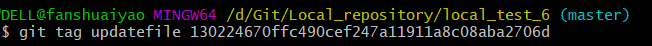

#### 在查看指定历史记录时，就可以用标签来指定，不用版本号了

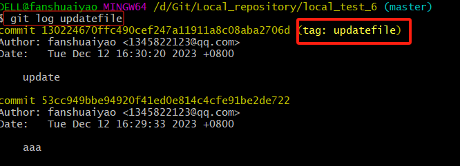

#### 删除标签 git tag -d 标签名

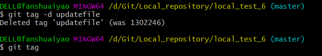

#### 本地仓库关联到远程仓库 【git remote add origin 地址】

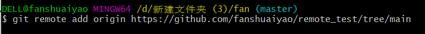

#### 远程仓库变化之后，用 git pull origin 来拉取最新代码

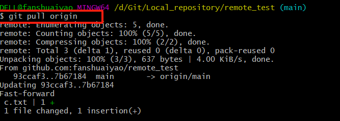

#### 使用git remote remove origin删除config文件中的origin配置

