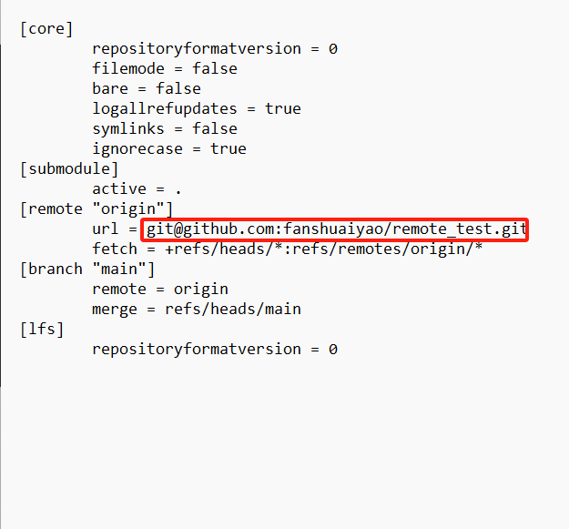
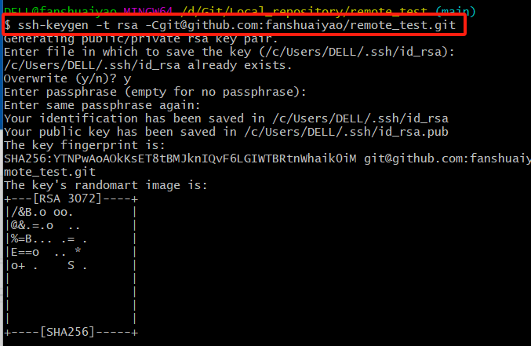
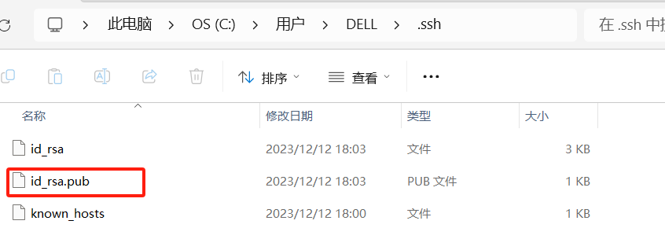
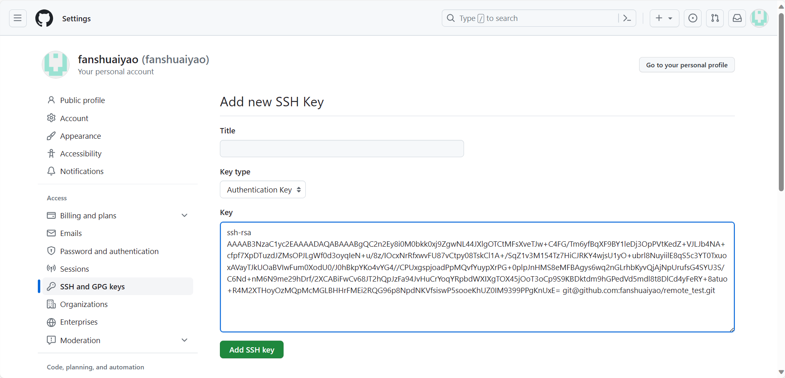
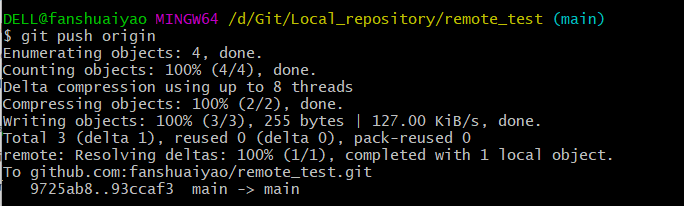

>  如果不想通过SSH推送，在config文件里面，将origin配置地址改成https://...

### SSh设置

将config的路径配置成ssh的路径

### 然后去生成安全证书

>  ssh-keygen -t rsa -Cgit@github.com:fanshuaiyao/remote_test.git

### 生成的密钥在这里，复制密钥

### 在github中设置密钥

这样就可以使用ssh来push了

